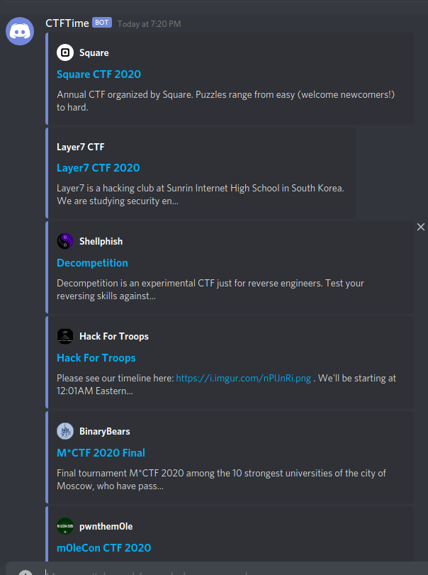

# ctftime-lambda

AWS Lambda function which will retrieve CTFs occurring in the next weekend and send them to a list of discord webhooks.  

Webhook information should be in the environmental variable `DISCORD_WEBHOOKS` in the format `id:token,id:token,id:token`

